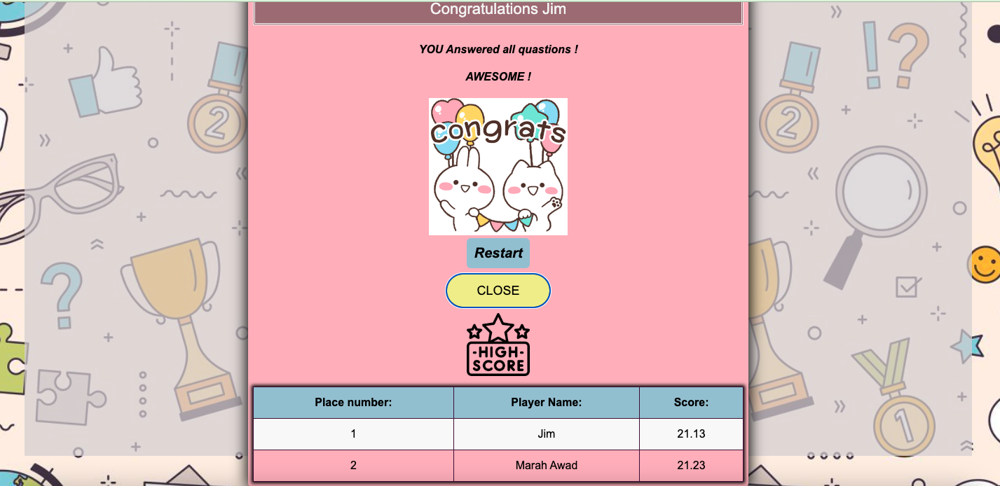

# A2 Quiz:
## Using terminal:
To build the target into the dist directory, use the first command: 
" npm run build".
Then to start the server that shows on a web page the content of the dist directory:
"npm run serve".  
And then you will receive a web address like: 
  ➜  Local:   http://localhost:4173/. Open it in your browser to begin the quiz.
To make sure there are no errors repodted you can run : 
"npm run lint"  

1. When you open the web page you will get the start of the game: 

2. Enter your name, and the questions will be presented to you:

3. You need to submit the answer in less than 10 second. If the time elapses, the game ends, and you'll need to restart: 

4. If you answer all questions correctly, you will get a congratulatory message:

You can see the 5 top scores any time when you click on the button "Top Score".

